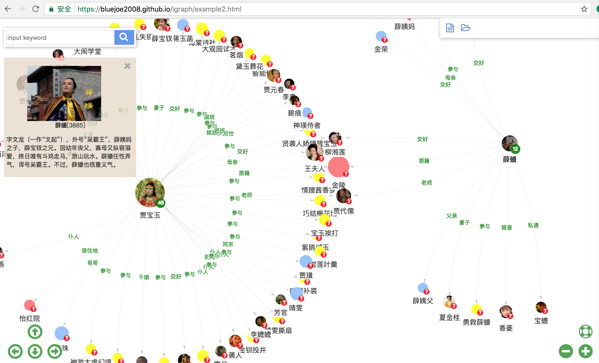
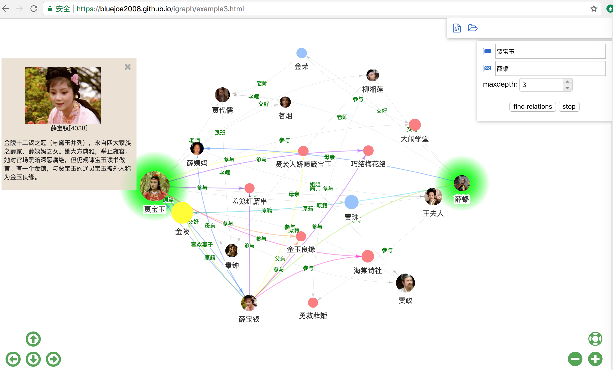

# InteractiveGraph
InteractiveGraph provides a web-based interactive framwork for operation on large graph databases.

InteractiveGraph also provides three applications built on the framework: `GraphNavigator`, `GraphExplorer` and `RelFinder`.

__GraphNavigator__: online demo https://bluejoe2008.github.io/igraph/example1.html


__GraphExplorer__: online demo 
https://bluejoe2008.github.io/igraph/example2.html


__RelFinder__: online demo https://bluejoe2008.github.io/igraph/example3.html


# Quick start
__Step 1.__ download `examples.zip` from `dist` directory: https://github.com/bluejoe2008/InteractiveGraph/blob/master/dist/examples.zip?raw=true

__Step 2.__ unzip and deploy `examples.zip` as a webapp in a Web server (Apache, Tomcat, etc). A Web server is required, otherwise the graph data loading via AJAX will get an error.

__Step 3.__ visit the webapp in Web browser, url may looks like:
https://localhost:8080/examples/example1.html

change `example1.html` to `examples2.html` or `examples3.html`, etc.

# How to use
__Step 1.__ download `interactive-graph-<VERSION>.zip`(`interactive-graph-0.1.0.zip`, for example) from `dist` directory: https://github.com/bluejoe2008/InteractiveGraph/blob/master/dist/interactive-graph-0.1.0.zip?raw=true

__Step 2.__ unzip `interactive-graph-<VERSION>.zip`, two files will be got: `interactive-graph.min.js` and `interactive-graph.min.css`.

__Step 3.__ import the `.js` and `.css` files in HTML page, like that:
```javascript
<script type="text/javascript" src="./lib/interactive-graph-0.1.0/interactive-graph.min.js"></script>
<link type="text/css" rel="stylesheet" href="./lib/interactive-graph-0.1.0/interactive-graph.min.css">
```

__Step 4.__ use functions and classes defined in `igraph` namespace:
```javascript
<script type="text/javascript">
    igraph.i18n.setLanguage("chs");
    var app = new igraph.GraphNavigator(document.getElementById('graphArea'));
    app.loadGson("honglou.json");
</script>
```
As shown above, a `GraphNavigator` application object is created and used to load graph data from `honglou.json`.

For more details, see https://github.com/bluejoe2008/InteractiveGraph/blob/master/dist/examples/example1.html.

To develop custom applications, it is a good idea to write new application classes derived on `GraphNavigator` and other application classes. Furthermore, users can create new application classes via using a `MainFrame` class directly.

# dependencies
this project depends on some open sourced components including `visjs`, `npm`, `gulp`, `jQuery`, `jQueryUI` and so on.

    

More dependencies, see https://github.com/bluejoe2008/InteractiveGraph/blob/master/package.json.

# MainFrame, applications

InteractiveGraph provides MainFrame class as a facade of Web UI, event handling and graph data processing.

## controls


## event handling

MainFrame embeds a EventEmmiter to handle events.

## data connector

# <a name="GSON">GSON</a>

# Datasets
## honglou.json
## WorldCup2014.json

# Applications

## GraphNavigator

## GraphExplorer

## RelFinder


# build & run

__Step 1.__ use `npm run build` or `gulp build` to build InteractiveGraphBrowser, which generates `igbrowser.min.js`.

in development mode, use `gulp dev` to generate `igbrowser.js`.

__Step 2.__ open `examples/example1.html` in web browser, such as `file:///Users/bluejoe/IdeaProjects/InteractiveGraphBrowser/examples/example1.html`. No web server is required, local file browse is ok.
