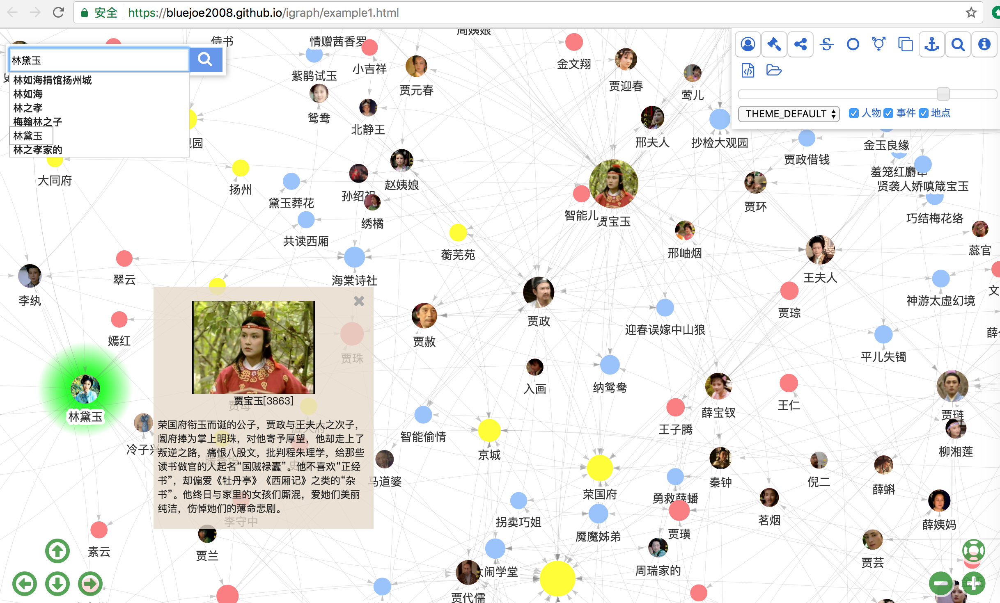
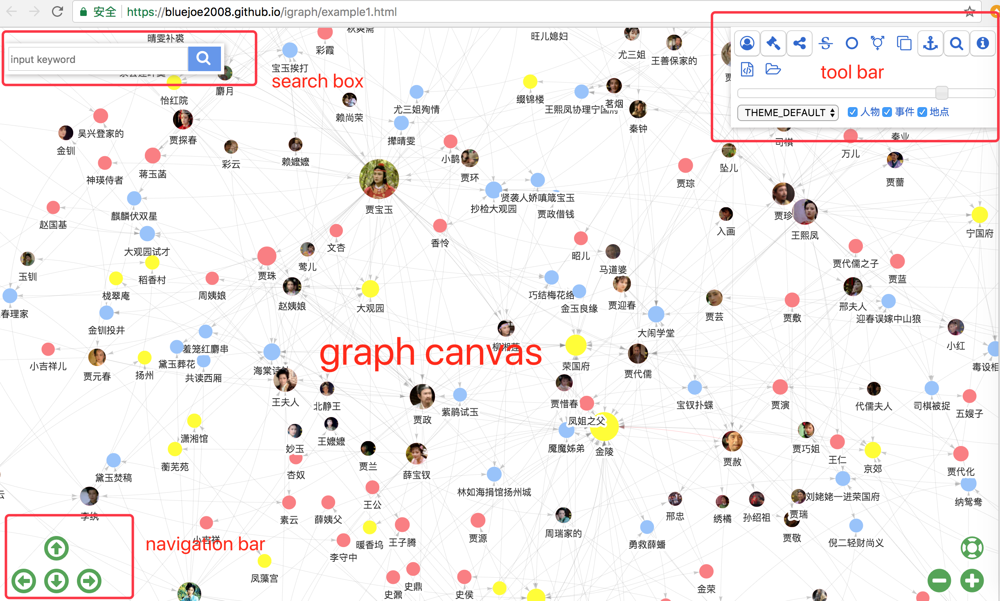
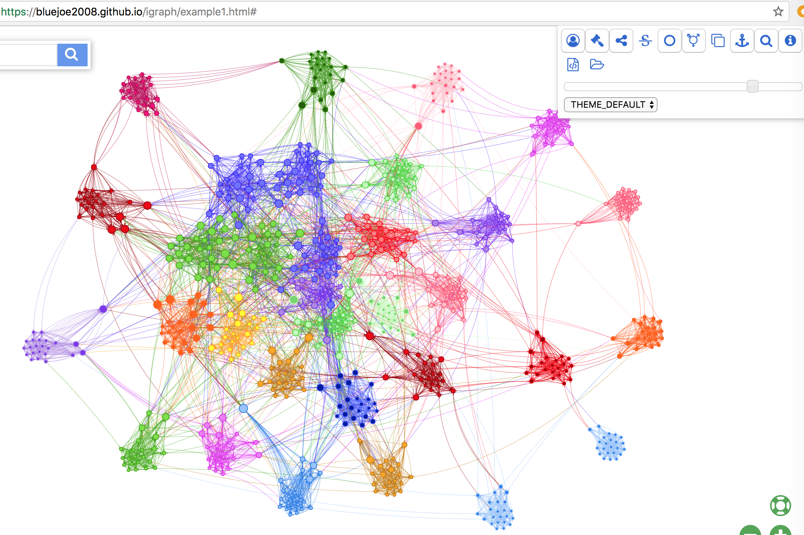

<!-- vscode-markdown-toc -->
* [快速开始(Quick Start)](#Quickstart)
* [使用方法(How to Use)](#Howtouse)
* [参考手册(Reference manual)](#Referencemanual)
	* [接口(InteractiveGraph API)](#InteractiveGraphAPI)
	* [项目依赖(dependencies)](#dependencies)
* [主框架及应用(MainFrame, applications)](#MainFrameapplications)
	* [控件(controls)](#controls)
	* [主题(theme)](#theme)
	* [事务处理(event handling)](#eventhandling)
	* [数据连接(data connector)](#dataconnector)
* [GSON](#GSON)
* [数据集(Datasets)](#Datasets)
	* [honglou.json](#honglou.json)
	* [WorldCup2014.json](#WorldCup2014.json)
* [应用(Applications)](#Applications)
	* [图导航器(GraphNavigator)](#GraphNavigator)
	* [图浏览器(GraphExplorer)](#GraphExplorer)
	* [关系查找器(RelFinder)](#RelFinder)
* [贡献(Contributing to InteractiveGraph)](#ContributingtoInteractiveGraph)
* [证书(LICENSE)](#LICENSE)

<!-- vscode-markdown-toc-config
	numbering=false
	autoSave=true
	/vscode-markdown-toc-config -->
<!-- /vscode-markdown-toc -->
# InteractiveGraph

[](https://github.com/grapheco/InteractiveGraph/releases)
[](https://github.com/grapheco/InteractiveGraph/releases)
[](https://github.com/grapheco/InteractiveGraph/issues)
[](https://github.com/grapheco/InteractiveGraph/network)
[](https://github.com/grapheco/InteractiveGraph/stargazers)
[](https://github.com/grapheco/InteractiveGraph/blob/master/LICENSE)


InteractiveGraph 为大型图数据提供了一个基于web的交互操作框架，其数据可以来自于GSON文件，或者在线Neo4j图数据库.
InteractiveGraph 也提供了三个基于本框架的应用：`GraphNavigator`, `GraphExplorer` 和 `RelFinder`


__图导航器(GraphNavigator)__: 在线试用 https://grapheco.github.io/InteractiveGraph/dist/examples/example1.html


__图浏览器(GraphExplorer)__: 在线试用 https://grapheco.github.io/InteractiveGraph/dist/examples/example2.html


__关系查找器(RelFinder)__: 在线试用 https://grapheco.github.io/InteractiveGraph/dist/examples/example3.html


## <a name='Quickstart'></a>快速开始(Quick Start)
__Step 1.__ 从`dist`处下载 `examples.zip`，链接如下:
https://github.com/grapheco/InteractiveGraph/dist/

__Step 2.__ 解压`examples.zip`，并将其部署在Web服务器上（比如Tomcat）. 如果不使用Web服务器，通过AJAX读取数据时将会出错.

__Step 3.__ 在浏览器中打开示例，url如下：
https://localhost:8080/examples/example1.html

把 `example1.html` 改为 `examples2.html` 或 `examples3.html`, 等，即可试用三个不同应用.

## <a name='Howtouse'></a>使用方法(How to use)
__Step 1.__ 下载 `interactive-graph-<VERSION>.zip`(如`interactive-graph-0.1.0.zip`) : 
https://github.com/grapheco/InteractiveGraph/dist/

__Step 2.__ 解压 `interactive-graph-<VERSION>.zip`, 将得到两个文件: `interactive-graph.min.js` 和 `interactive-graph.min.css`.

__Step 3.__ 在HTML中import `.js` 和 `.css` 文件，比如：
```javascript
<script type="text/javascript" src="./lib/interactive-graph-0.1.0/interactive-graph.min.js"></script>
<link type="text/css" rel="stylesheet" href="./lib/interactive-graph-0.1.0/interactive-graph.min.css">
```

__Step 4.__ 使用在 `igraph` 中定义的函数和类：
```javascript
<script type="text/javascript">
    igraph.i18n.setLanguage("chs");
    var app = new igraph.GraphNavigator(document.getElementById('graphArea'));
    app.loadGson("honglou.json");
</script>
```
按上述步骤操作，将会使用`honglou.json`中的数据创建一个 `GraphNavigator` 应用对象.

更多详细信息, 请参见 https://github.com/grapheco/InteractiveGraph/blob/master/dist/examples/example1.html.

如若需要扩展应用，可以根据`GraphNavigator`或其他应用写衍生类，也可以通过使用 `MainFrame` 直接创建新的应用.

## <a name='Referencemanual'></a>参考手册(Reference manual)

### <a name='InteractiveGraphAPI'></a>接口(InteractiveGraph API)
InteractiveGraph是用TypeScript写的，如果需要获取在线API文档，请参见：
https://grapheco.github.io/InteractiveGraph/dist/api/index.html


### <a name='dependencies'></a>项目依赖(dependencies)
在开发InteractiveGraph时，依赖了一些开源项目，包括但不仅限于`visjs`, `npm`, `gulp`, `jQuery`, `jQueryUI`, `Font Awesome`.

     

关于项目依赖的详情,请参见 https://github.com/grapheco/InteractiveGraph/blob/master/package.json.

## <a name='MainFrameapplications'></a>主框架及应用(MainFrame, applications)

InteracticeGraph 提供了一个`MainFrame`框架，它实际上对Web UI,事务处理和图数据连接的包装，并为用户提供了简洁易用的接口.
InteractiveGraph provides a MainFrame, which actually is a facade of Web UI, event handling and graph data connection.

### <a name='控件(controls)'></a>控件(controls)



如上所示，MainFrame包括了一个主图形渲染画布，一组导航按钮，以及搜索栏，工具栏，信息框，高亮控件等控件.

一些控件是带有Web UI的，比如信息框，消息框等. 但是其他一些组件是没有UI的，比如HighlightNode控件和ExpansionCtrl等控件等.
在InteractiveGraph中，我们定义了一个`Control`类，以及它的两个衍生类`UIControl`（带UI的组件）和`BGControl`（不带UI的后台控件）.

下表所列是项目中的全部控件.

| control | function | type |
|-|-|-|
|ConnectCtrl|show a load data dialog|UIControl|
|ExpansionCtrl|expands a graph node on double click|BGControl|
|HighlightNodeCtrl|highlight selected graph nodes|BGControl|
|InfoBoxCtrl|show a infomation box on click on a graph node|UIControl|
|MessageBoxCtrl|show a message box on demand|UIControl|
|RelFinderCtrl|finding relations between graph nodes|BGControl|
|RelFinderDialogCtrl|show a dialog for user to launch a finding task|UIControl|
|SearchBarCtrl|show a search bar for keyword input|UIControl|
|ToolbarCtrl|show a tool bar|UIControl|

### <a name='theme'></a>主题(theme)
略

### <a name='eventhandling'></a>事务处理(event handling)

主框架及其控件通过事务与应用通信.例如，当窗口大小被重置，主框架及其所有控件将会接收到FRAME_RESIZE事务.

如需订阅事务，可以通过主框架或控件调用`on(event, handler)`.相反，若需要取消订阅，可以使用`off(event, handler)`方法.

如果需要从主框架上关闭事务，可以使用`MainFrame.emit(event, args)`或`MainFrame.fire(event, args)`方法.不同于`emit()`方法的是，`fire()`在执行关闭之前，会将包括`mainFrame`, `htmlMainFrame`和`theme`在内的上下文信息置入到`args`.如果想从控件上关闭时间，可以使用`emit(event, args)`方法.

### <a name='dataconnector'></a>数据连接(data connector)

主框架通过`Connector`加载数据，`Connector`可能连接到`LocalGraph`或`RemoteGraph`.其中`LocalGraph`是一次性从GSON对象或文件中一次性加载全部数据，而`RemoteGraph`则在本地没有缓存数据时，与远程图服务器交互，从中获取数据和服务.
MainFrame loads data via a `Connector` which may connect to a `LocalGraph` or a `RemoteGraph`. A `LocalGraph` loads all data once from a GSON object or file, while a `RemoteGraph` interacts with a remote graph server each time if no cache data is available.

## <a name='GSON'></a>GSON

主框架以`GSON`格式从`LocalGraph`中读取数据.`GSON`实际上是一种针对于图数据的强化的`JSON`格式.其强化之处在于，`GSON`可以识别`function`，而这在`JSON`中是不合法的.
`GSON` 由一些数据项组成，其定义如下：

```typescript
export interface GSON {
    "data": {
        nodes: object[];
        edges?: object[];
    }
    "dbinfo"?: object;
    "categories"?: object;
    "translator"?: {
        "nodes"?: (node: object) => void;
        "edges"?: (node: object) => void;
    };
}
```

此处，`translator`是对于图中节点和边的translator函数的定义，加载数据时会调用这个函数.示例如下，在这个例子中，在加载时为每个节点的`description`赋值.

```javascript
  "translator": {
    "nodes": function (node) {
      //set description
      if (node.description === undefined) {
        var description = "<p align=center>";
          description += "<br>";
        description += "<b>" + node.label + "</b>" + "[" + node.id + "]";
        description += "</p>";
        node.description = description;
      }
    },
  }
```

## <a name='Datasets'></a>数据集(Datasets)

示例中以`.json`文件的形式提供了两个GSON数据集：honglou.json, WorldCup2014.json.

### <a name='honglou.json'></a>honglou.json

honglou.json数据集来自于中国古典名著《红楼梦》（又名《石头记》，https://en.wikipedia.org/wiki/Dream_of_the_Red_Chamber），在这部小说中贾宝玉、林黛玉、薛宝钗是主要人物. 这个数据集中定义了超过300个实体，其中包括书中的人物，地点和时间，以及超过500个这些实体之间的连接.

nickel2008@github 提供了数据集. 此数据集中或有纰漏，但是对于一个图数据项目的示例来说已经足够好了.

### <a name='WorldCup2014.json'></a>WorldCup2014.json

World Cup 2014数据集来自http://visjs.org/examples/network/exampleApplications/worldCupPerformance.html.
其中边浇多，因此绘制时对算力要求较高.

下边的屏幕截图展示了在`GraphNavigator`中，WorldCup2014.json是如何渲染的.



## <a name='Applications'></a>应用(Applications)

### <a name='GraphNavigator'></a>图导航器(GraphNavigator)

### <a name='GraphExplorer'></a>图浏览器(GraphExplorer)

### <a name='RelFinder'></a>关系查找器(RelFinder)

## <a name='ContributingtoInteractiveGraph'></a>贡献(Contributing to InteractiveGraph)

真诚地感谢您为InteractiveGraph提交的任何代码或文档.如果您有好的想法和创意，请fork本项目，并创建pull请求.

* 若要贡献新的应用，您可以定义`BaseApp`的新衍生类.

* 若要贡献任何控价，您可以定义`UIControl`和`BGControl`的衍生控件类.

* 欢迎贡献新的主题

* 若要贡献新的工具按钮，您可以定义新的ButtonInfos.请注意，在按钮图标中可以找到`Font Awesome`的图标.

* 若要贡献新的数据集或对数据集的修改，您可以以GSON格式提交！
* To contribute new data sets or modification, you may submit data in GSON format!

## <a name='LICENSE'></a>证书(LICENSE)

InteractiveGraph 使用 BSD 2-Clause "Simplified"证书.

最后，非常感谢您在项目中使用InteractiveGraph，为了更好地改进，我们真诚地想获取您的意见及使用情况，请将您的github用户名，您所在的组织和您的项目填写在下边的使用情况表中，非常感谢！
https://github.com/grapheco/InteractiveGraph/wiki/use-case-collection